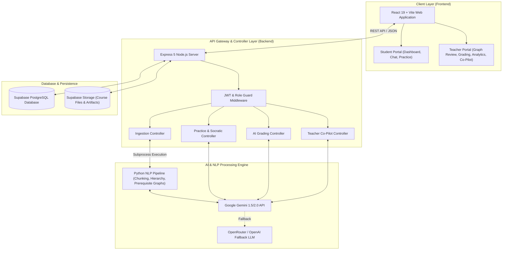

<div align="center">

# 🎓 Learnify — AI Tutor & Educator Co-Pilot
### *Smart India Hackathon (SIH S28) — Intelligent, Adaptive Learning & Course Management System*

[](https://react.dev/)
[](https://nodejs.org/)
[](https://expressjs.com/)
[](https://ai.google.dev/)
[](https://supabase.com/)
[](https://www.python.org/)
[](LICENSE)

<br />

**Learnify** is an end-to-end, AI-native educational platform engineered to transform personalized learning and empower educators. Built for **SIH Problem Statement S28**, Learnify seamlessly integrates **Socratic multi-level tutoring**, **automated curriculum chunking and prerequisite graph synthesis**, **AI-assisted rubric grading**, and **real-time class analytics** into a sleek, intuitive experience.

[Key Features](#-key-features) • [System Architecture](#-system-architecture) • [Tech Stack](#-tech-stack) • [Getting Started](#-getting-started) • [API Reference](#-api-reference) • [Project Structure](#-project-structure)

</div>

---

## 🌟 Key Features

### 🎓 For Students
* 🧠 **Multi-Level Socratic Explanations**: Ask any complex concept and receive tailored explanations across 4 distinct learning styles:
  * **ELI5 (Explain Like I'm 5)** — Intuitive analogies & visual breakdowns.
  * **Intuitive / Standard** — Core concepts & real-world applications.
  * **Mathematical / Formal** — Equations, proofs, and rigorous definitions.
  * **Code / Hands-on** — Practical code snippets, algorithms, and implementations.
* 🎯 **Adaptive Practice & Socratic Guidance**: Solve targeted practice problems with multi-stage hint requests, step-by-step guidance, and guided answer reveals without giving away answers immediately.
* 🔍 **Automatic Learning Gap Detection**: Real-time tracking of session events to identify missing prerequisites during problem-solving and automatically surface recommended remedial topics.
* 📊 **Personalized Student Dashboard**: Real-time metrics tracking topic mastery, completed assignments, active courses, and recent learning activity.
* 📚 **Course Content Library**: Browse published courses, download study materials, and track progress module-by-module.

---

### 👨‍🏫 For Educators & Admins
* 📄 **Automated AI Course Ingestion**: Upload course materials (PDF, TXT) to automatically run Python NLP pipelines for intelligent document chunking, concept extraction, and hierarchical structure synthesis.
* 🕸️ **Prerequisite Graph Visualizer & Editor**: Interactively review, edit, approve, or request AI revisions on generated prerequisite knowledge graphs before publishing to students.
* 🤖 **Teacher AI Co-Pilot**: An embedded conversational assistant for educators to rapidly draft lesson plans, generate quizzes, clarify curriculum queries, and manage course artifacts.
* 📝 **AI-Assisted Automated Grading**: Accelerate assignment evaluation with instant AI rubric scoring, detailed feedback breakdowns, manual score overrides, and batch grade publishing.
* 📈 **Class-Wide Analytics & Misconception Matrix**: Detect macro-level class trends, identify recurring student misconceptions, track concept mastery distributions, and generate targeted intervention strategies.

---

## 🏗️ System Architecture



---

## 🛠️ Tech Stack

| Layer | Technology | Purpose / Role |
| :--- | :--- | :--- |
| **Frontend** |   | Fast, responsive Single Page Application with dynamic dashboards |
| **Routing & Icons** | `react-router-dom v7`, `lucide-react` | Clean navigation with strict role-based route guards and modern icons |
| **Styling** | Vanilla CSS (CSS Variables) | Custom glassmorphism, responsive grid layouts, and curated color palettes |
| **Backend API** |   | RESTful API server handling authentication, business logic, and routing |
| **AI / LLM Provider** |  `OpenAI / OpenRouter` | Socratic dialogue generation, AI grading, explanation engine, co-pilot |
| **NLP Engine** |  | Document chunking, concept hierarchy building, prerequisite graph extraction |
| **Database & Auth** |  | PostgreSQL database, JWT authentication, and file storage |
| **Task Runner** | `concurrently` | Concurrent execution of Backend and Frontend services in development |
| **Testing & Linting**| `Jest`, `Supertest`, `Oxlint` | Unit testing, API endpoint integration tests, and linting |

---

## 📁 Project Structure

```
S28-AI-Tutor-SIH/
├── package.json               # Root workspace runner scripts
├── test_course.txt            # Sample course file for ingestion testing
├── README.md                  # Comprehensive project documentation
├── Backend/                   # Express API Server & Python NLP Engine
│   ├── index.js               # Server entry point (Port 3002)
│   ├── package.json           # Backend dependencies & test scripts
│   ├── Dockerfile             # Container configuration
│   ├── .env.example           # Environment variables template
│   ├── python/                # Python NLP & Graph Processing Scripts
│   │   ├── chunking.py            # Document chunking & tokenization
│   │   ├── concept_extraction.py  # Concept & domain entity recognition
│   │   ├── prerequisite_graph.py  # Dependency graph construction
│   │   ├── graph_validation.py    # Cycle detection & graph sanity
│   │   └── requirements.txt       # Python dependencies
│   ├── src/
│   │   ├── app.js             # Express app setup & middleware bindings
│   │   ├── routes/            # Unified API routes (/api/...)
│   │   ├── controllers/       # Business logic handlers
│   │   │   ├── copilot.controller.js       # Teacher co-pilot assistant
│   │   │   ├── course.controller.js        # Course lifecycle & graph approval
│   │   │   ├── gap.controller.js           # Learning gap detection & events
│   │   │   ├── grading.controller.js       # AI assignment grading & rubrics
│   │   │   ├── ingest.controller.js        # File upload & prerequisite pipeline
│   │   │   ├── misconception.controller.js # Misconception analysis
│   │   │   ├── practice.controller.js      # Socratic practice & hints
│   │   │   └── retrieval.controller.js     # Vector / concept retrieval
│   │   ├── middleware/        # Authentication & Role Authorization guards
│   │   └── services/          # Gemini API wrapper, DB services
│   └── tests/                 # Jest integration & E2E unit tests
└── Frontend/                  # React + Vite Frontend Application
    ├── package.json           # Frontend dependencies
    ├── vite.config.js         # Vite bundler configuration
    └── src/
        ├── App.jsx            # Application routes & layout wrapper
        ├── main.jsx           # React DOM entry point
        ├── index.css          # Core design tokens & responsive UI styling
        ├── components/        # Reusable UI components
        │   ├── auth/          # RequireRole protection wrapper
        │   ├── layout/        # AppShell layout with sidebar & header
        │   ├── tutor/         # StudentChat, TeacherCopilotChat, Graph Visualizer
        │   └── Practice.jsx   # Practice & hint request component
        ├── pages/             # Page views
        │   ├── Home.jsx                    # Dynamic Student landing
        │   ├── Login.jsx                   # Role selection & authentication
        │   ├── StudentDashboard.jsx        # Mastery & analytics overview
        │   ├── StudentAssignments.jsx      # Submissions & feedback
        │   ├── TeacherHomeLanding.jsx      # Teacher home hub
        │   ├── TeacherPrerequisites.jsx    # Course upload & graph reviewer
        │   ├── TeacherGrading.jsx          # AI-assisted grading interface
        │   ├── TeacherAnalytics.jsx        # Class performance analytics
        │   └── TeacherMisconceptions.jsx  # Student misconception matrix
        └── services/          # API client services & mock data fallbacks
```

---

## 🚀 Getting Started

### 📋 Prerequisites
Make sure you have the following installed on your environment:
* **Node.js** (v18.0.0 or higher)
* **npm** (v9.0.0 or higher)
* **Python** (v3.9 or higher)
* **Google Gemini API Key** ([Get key from Google AI Studio](https://aistudio.google.com/))
* **Supabase Project** (URL & Service Role Key)

---

### 📥 1. Installation

Clone the repository and install all workspace dependencies:

```bash
# Clone the repository
git clone https://github.com/YourUsername/S28-AI-Tutor-SIH.git
cd S28-AI-Tutor-SIH

# Install root dependencies
npm install

# Install all sub-packages (Backend & Frontend) in one command
npm run install:all
```

Install Python NLP dependencies:

```bash
cd Backend/python
pip install -r requirements.txt
cd ../..
```

---

### 🔑 2. Environment Configuration

Create a `.env` file inside the `Backend/` directory based on `.env.example`:

```bash
# Navigate to Backend folder
cd Backend
cp .env.example .env
```

Populate the `.env` file with your credentials:

```env
# Google Gemini Credentials
GEMINI_API_KEY=your_gemini_api_key_here

# Supabase Credentials
SUPABASE_URL=https://your-supabase-project-id.supabase.co
SUPABASE_SERVICE_ROLE_KEY=your_supabase_service_role_key_here

# Optional: OpenRouter / LLM Fallback
OPENROUTER_API_KEY=your_openrouter_api_key_here
OPENROUTER_FALLBACK_MODEL=openrouter/free
FORCE_LLM_FALLBACK=false

# Port & Secret Setup
PORT=3002
JWT_SECRET=your_jwt_secret_key_here
```

---

### 🏃 3. Running the Application

Launch both the **Backend** API (Port 3002) and **Frontend** App (Port 5173 / Vite default) concurrently using a single command from the project root:

```bash
npm run dev
```

* **Frontend App**: `http://localhost:5173` (or the URL displayed in terminal)
* **Backend API**: `http://localhost:3002`

---

## 📡 API Reference Overview

All backend endpoints require an `Authorization: Bearer <token>` header unless specified otherwise.

| Method | Endpoint | Access | Description |
| :--- | :--- | :--- | :--- |
| `POST` | `/api/explain` | Public/Auth | Generates multi-level explanations (ELI5, Intuitive, Formal, Code) |
| `POST` | `/api/retrieve` | Public/Auth | Retrieves top relevant course chunks for a given query |
| `POST` | `/api/practice-questions` | Auth | Creates or fetches adaptive practice questions |
| `POST` | `/api/practice-questions/:id/hint` | Auth | Requests Socratic hints for a question step |
| `POST` | `/api/practice-questions/:id/socratic` | Auth | Evaluates student reasoning with Socratic guidance |
| `POST` | `/api/ingest/upload` | Teacher | Uploads PDF/TXT course files for automated NLP ingestion |
| `POST` | `/api/ingest/generate-prerequisites` | Teacher | Runs Python graph extraction to produce concept prerequisite trees |
| `POST` | `/api/courses/:courseName/approve` | Teacher | Approves generated course prerequisite graph |
| `POST` | `/api/courses/:courseName/publish` | Teacher | Publishes approved course to student catalog |
| `POST` | `/api/teacher-copilot` | Teacher | Sends query to AI Teacher Co-pilot for lesson plans & help |
| `GET`  | `/api/analytics/class` | Teacher | Retrieves class performance, mastery scores, and progress |
| `GET`  | `/api/misconceptions` | Teacher | Retrieves identified student misconceptions and interventions |
| `GET`  | `/api/assignments` | Auth | Lists active assignments for student or teacher |
| `POST` | `/api/submissions/:id/ai-suggest` | Teacher | Generates automated AI grade suggestions with rubric feedback |

---

## 🧪 Testing & Quality Assurance

### Run Backend Unit & Integration Tests
The backend uses **Jest** and **Supertest** to test all controller endpoints, authentication guards, and fallback mechanics:

```bash
cd Backend
npm test
```

### Run Frontend Linting
Run **Oxlint** to maintain high-performance, clean React code:

```bash
cd Frontend
npm run lint
```

---

## 🛡️ License

Distributed under the **ISC License**. See `LICENSE` for more information.

---

<div align="center">
  <sub>Built with ❤️ for <b>Smart India Hackathon (SIH Problem Statement S28)</b></sub>
</div>
