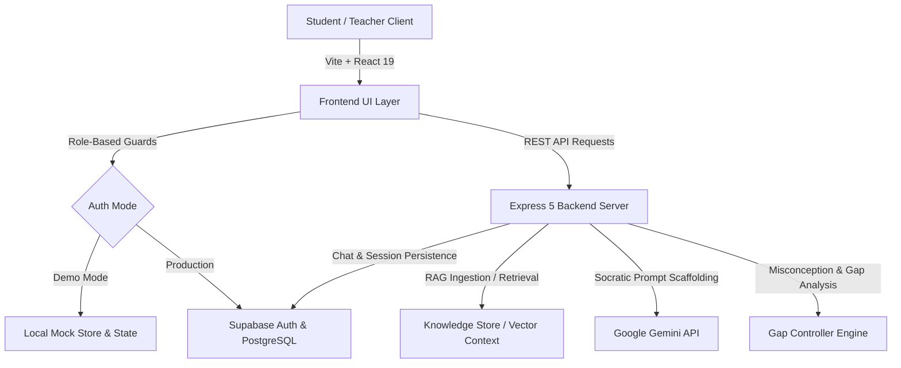

# 🎓 Learnify — AI Socratic Tutor (SIH)

<div align="center">

[](https://react.dev/)
[](https://expressjs.com/)
[](https://ai.google.dev/)
[](https://supabase.com/)
[](LICENSE)

**An intelligent, adaptive Socratic learning platform built for the Smart India Hackathon (SIH).**  
Learnify empowers students with guided, step-by-step conceptual discovery while equipping educators with actionable learning gap and misconception analytics.

</div>

---

## 🌟 Key Highlights

- 🧠 **Socratic AI Guidance**: Encourages active problem-solving and critical thinking rather than spoon-feeding answers.
- 🪜 **Progressive 3-Tier Hint Ladder**: Adaptive scaffolding ranging from gentle nudges to step-by-step conceptual breakdowns.
- 🔍 **Real-Time Misconception & Learning Gap Detection**: Continuously evaluates student reasoning to identify foundational gaps and misconceptions.
- 📊 **Educator & Cohort Analytics**: Real-time dashboards visualizing student struggle points, topic mastery distributions, and cohort progress.
- 📚 **RAG-Powered Document & Curriculum Ingestion**: Allows teachers to upload syllabus materials, PDFs, and lesson notes for syllabus-grounded tutoring.
- 🛡️ **Role-Based Access Control (RBAC)**: Dedicated, isolated portals and route guards for Students and Teachers.
- ⚡ **Zero-Setup Mock Mode**: Instant test and demonstration mode with mock authentication and responses, plus live Supabase & Gemini integration.

---

## 🏗️ System Architecture



---

## 📂 Project Structure

```text
S28-AI-Tutor-SIH/
├── Frontend/                      # React 19 + Vite Client
│   ├── src/
│   │   ├── components/            # Reusable UI components
│   │   │   ├── auth/              # RBAC guards & role switchers
│   │   │   ├── cards/             # Dashboard & stat cards
│   │   │   ├── common/            # Buttons, badges, and modals
│   │   │   ├── layout/            # AppShell, Navigation, & Sidebar
│   │   │   └── tutor/             # HintSystem, ChatBox, & TopicNav
│   │   ├── context/               # AuthContext & global providers
│   │   ├── pages/                 # Main route pages
│   │   │   ├── Home.jsx           # Course & topic catalog
│   │   │   ├── Login.jsx          # Role-based login & demo access
│   │   │   ├── ChatPage.jsx       # Interactive Socratic AI workspace
│   │   │   ├── StudentDashboard.jsx # Student progress & mastery tracking
│   │   │   ├── TeacherDashboard.jsx # Analytics, gap heatmap, & ingestion
│   │   │   └── LibraryPage.jsx    # Concept library & syllabus browser
│   │   ├── services/              # API clients & backend connectors
│   │   └── index.css              # Custom styling & design tokens
│   ├── package.json
│   └── vite.config.js
│
├── Backend/                       # Express.js API & AI Service
│   ├── src/
│   │   ├── controllers/           # API controllers
│   │   │   ├── explain.controller.js      # Gemini Socratic generation
│   │   │   ├── gap.controller.js          # Learning gap detection
│   │   │   ├── misconception.controller.js# Misconception aggregator
│   │   │   ├── ingest.controller.js       # File upload & document RAG
│   │   │   ├── chatlog.controller.js      # Session & chat log storage
│   │   │   └── retrieval.controller.js    # Contextual knowledge retrieval
│   │   ├── middleware/            # Auth & RBAC verification middleware
│   │   ├── routes/                # Express API route endpoints
│   │   ├── services/              # Retrieval & embedding services
│   │   └── lib/                   # Supabase admin client configuration
│   ├── scripts/                   # Database schemas & spike tests
│   ├── index.js                   # Server entrypoint
│   └── package.json
│
└── README.md                      # Project documentation
```

---

## 🚀 Getting Started

### Prerequisites

- **Node.js**: v18.0.0 or higher
- **npm** or **yarn** / **pnpm**
- *(Optional for live AI)*: [Google Gemini API Key](https://aistudio.google.com/)
- *(Optional for live DB)*: [Supabase Project URL & Service Key](https://supabase.com/)

---

### 1. Clone the Repository

```bash
git clone https://github.com/Smr123-ddca/S28-AI-Tutor-SIH.git
cd S28-AI-Tutor-SIH
```

---

### 2. Backend Setup

1. Navigate to the backend directory and install dependencies:
   ```bash
   cd Backend
   npm install
   ```

2. Create a `.env` file in `Backend/`:
   ```env
   PORT=3000
   GEMINI_API_KEY=your_gemini_api_key_here
   SUPABASE_URL=https://your-project.supabase.co
   SUPABASE_SERVICE_ROLE_KEY=your_supabase_service_role_key
   ```

3. Run the backend server:
   ```bash
   node index.js
   ```
   > Server will start at `http://localhost:3000`

---

### 3. Frontend Setup

1. Open a new terminal, navigate to the frontend directory, and install dependencies:
   ```bash
   cd Frontend
   npm install
   ```

2. Create or verify `.env` in `Frontend/`:
   ```env
   # Set to true for offline / zero-setup mock mode:
   VITE_MOCK_AUTH=true
   VITE_USE_MOCKS=true

   # Or connect with Supabase:
   VITE_SUPABASE_URL=https://your-project.supabase.co
   VITE_SUPABASE_ANON_KEY=your_supabase_anon_key
   ```

3. Launch the development server:
   ```bash
   npm run dev
   ```
   > Client will be available at `http://localhost:5173`

---

## 💡 Key Features & Workflow

### 1. Student Experience (`/dashboard` & `/chat`)
- **Socratic Interaction**: Ask questions or attempt difficult problems. The AI will guide you conceptually without giving away the direct answer immediately.
- **Hint Ladder**: Unlock 3 levels of hints (*Gentle Nudge* ➔ *Conceptual Clue* ➔ *Step-by-Step Walkthrough*) when stuck.
- **Mastery Tracker**: View continuous assessment metrics, completed topics, and targeted suggestions.

### 2. Teacher Experience (`/teacher`)
- **Misconception Detection**: Identify common patterns where students get confused across different topics.
- **Learning Gap Heatmap**: Real-time alerts highlighting students needing direct intervention.
- **Document Ingestion**: Upload custom PDFs and class notes to dynamically ground the tutor's knowledge base.

---

## 📡 API Reference Overview

| Method | Endpoint | Description | Access |
|---|---|---|---|
| `POST` | `/api/explain` | Generates Socratic responses & progressive hints | Student / Teacher |
| `POST` | `/api/retrieve` | Context retrieval from ingested knowledge base | Authenticated |
| `POST` | `/api/session-event` | Records student response times & hint requests | Student |
| `POST` | `/api/detect-gap` | Evaluates student message for learning gaps | Student / System |
| `GET` | `/api/misconceptions` | Fetches cohort aggregated misconception logs | Teacher Only |
| `POST` | `/api/ingest/upload` | Ingests new curriculum documents (PDF/Text) | Teacher Only |
| `GET` | `/api/sessions` | Lists chat sessions for current user | Authenticated |
| `POST` | `/api/sessions` | Creates a new chat session | Authenticated |

---

## 🧪 Testing

Run backend tests using Jest:
```bash
cd Backend
npm test
```

---

## 🤝 Contributing & Hackathon Team

Developed with ❤️ for **Smart India Hackathon (SIH)**.  
Contributions, feedback, and issue submissions are always welcome!
